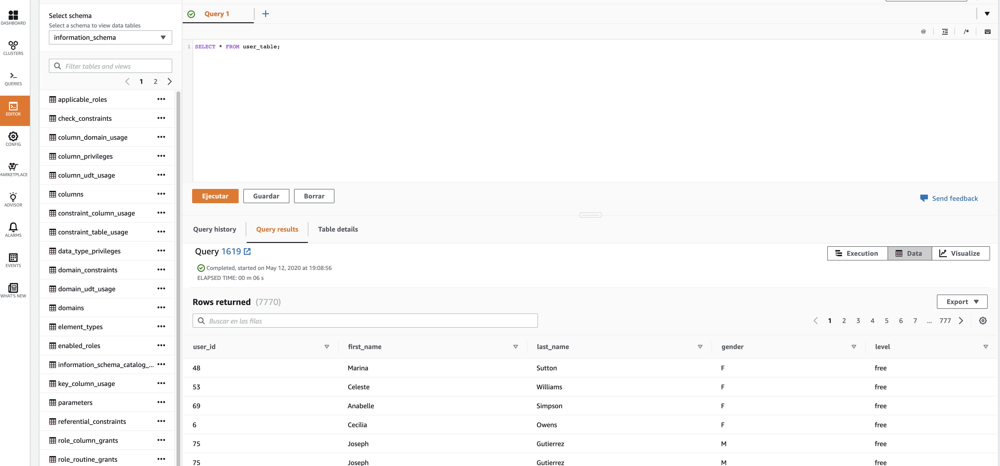

# Data Warehouse

The **purpose** of this analytic project is designed to members of analytical departament of sparkify. 

The goal is that this employees can understand how data flow in their domains. 
The data will be stored in databases to give the opportunity to apply stadistics for get conclusiones. 
The most played song or the less for example

## BBDD design

The database design is a star schema composed by fact table:
- songplay

And domain tables:
- users
- artists
- time 
- songs

## Desing Explanation

We get our data (songs, log_data) from a bucket on amazon s3. For the ingest of log data, mapping structure map was necessary for get the columns in with correct names I decided to assign primary keys as distkey in redshift. And with a study of the data we determine sortkey in the columns that are more frequently for use in where clause.

## How to execute

- 1. Create a IAM user
- 2. Create a redshift cluster
- 3. Specify the necessary conf in dwh
- 4. Execute create_tables.py
- 5. Execute etl.py

Additionaly you can check how we build our cluster in Infrastructure.ipynb

# Example of result data in redshift query editor

The data can be checked in redshift query editor like the following image:

